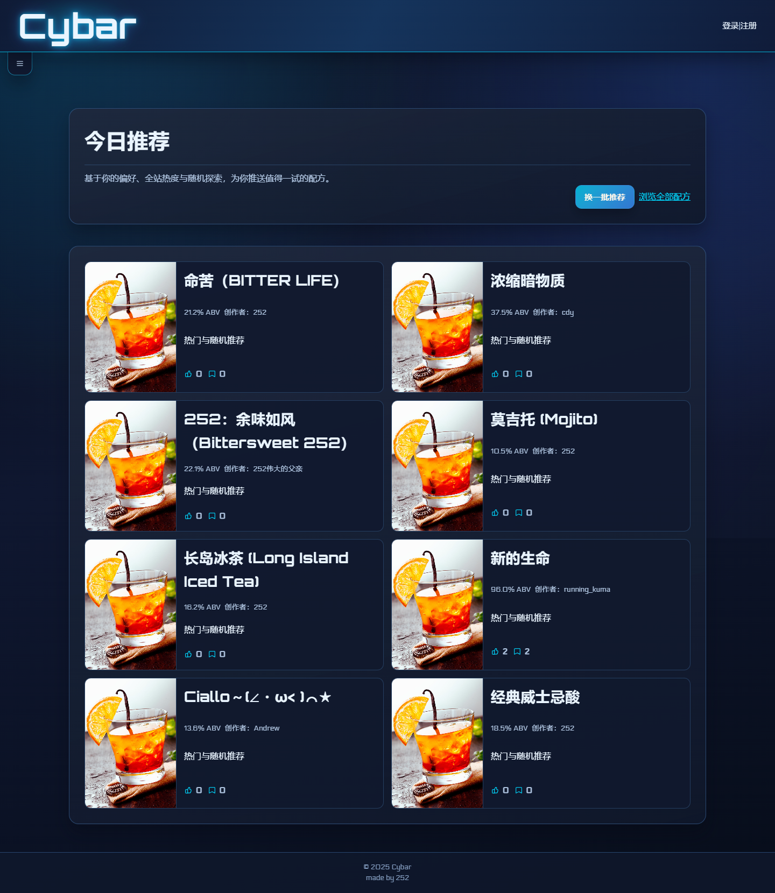
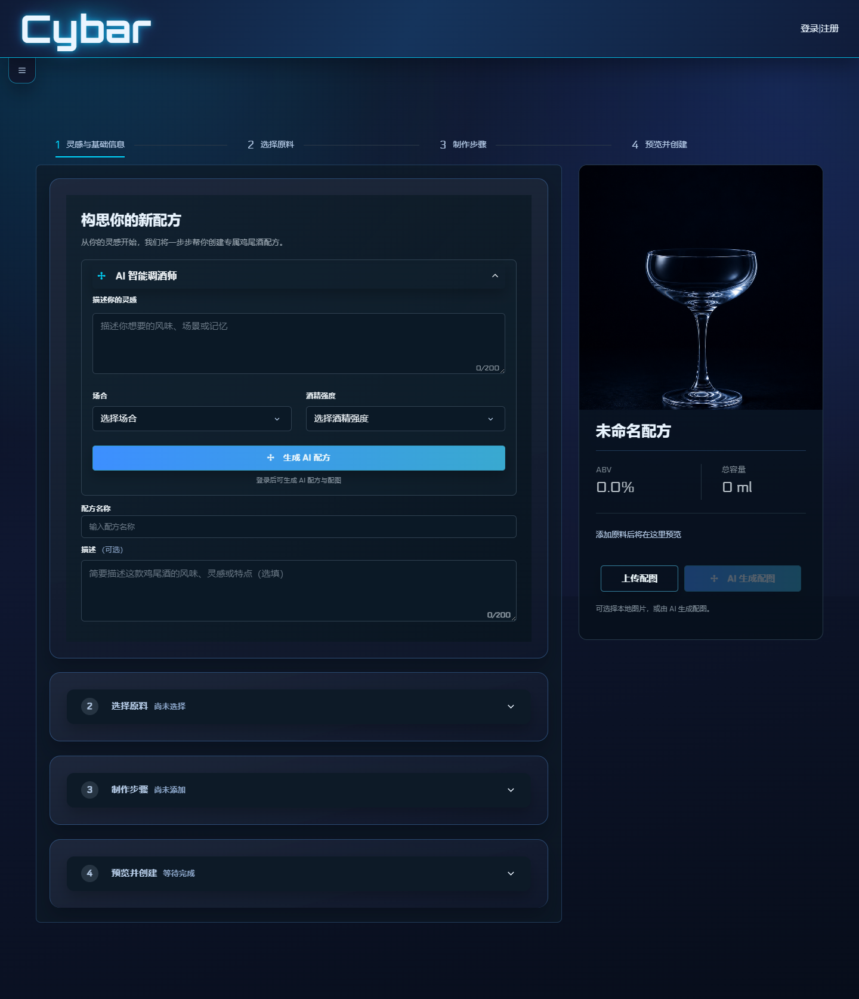

<div align="center">

# 🍸 Cybar

### 发现灵感，调出属于你的那一杯

一个集配方探索、社区互动与 AI 创作为一体的鸡尾酒配方平台。

[](https://nodejs.org/)
[](https://expressjs.com/)
[](https://www.mysql.com/)

[项目介绍](#项目介绍) · [界面展示](#界面展示) · [快速开始](#快速开始) · [AI 能力](#ai-能力) · [项目结构](#项目结构)

</div>



## 项目介绍

Cybar 不只是一份鸡尾酒配方列表，它希望把“发现、创作、分享”串成一次完整体验。

你可以从首页推荐中寻找下一杯酒的灵感，按名称或原料检索社区配方，查看容量、预估酒精度与制作步骤；也可以从一段口味描述出发，让 AI 生成配方和成品配图，再通过四步创作流程调整原料、步骤与封面并发布到社区。点赞、收藏和评论会沉淀为个人偏好，用于后续推荐。

项目采用原生前端与 Express + MySQL 架构，覆盖普通用户、内容创作者和管理员三类使用场景，适合作为完整 Web 应用、AI 应用集成或鸡尾酒主题社区项目运行与继续开发。

## 核心亮点

| | 能力 | 体验 |
| --- | --- | --- |
| ✦ | **智能推荐** | 匿名状态结合热度与随机探索；登录后根据点赞、收藏、酒精度和创作者偏好提供个性化结果 |
| ✣ | **AI 调酒师** | 根据风味、场合和酒精强度生成结构化配方，并可主动生成无文字成品配图 |
| ◈ | **四步配方创作** | 从灵感、原料、制作步骤到实时预览，自动计算总容量与预估 ABV |
| ♡ | **配方社区** | 支持搜索、排序、点赞、收藏、评论，以及作者配方的编辑和删除 |
| ◎ | **个人空间** | 管理头像、签名与资料，集中查看点赞、收藏和自己发布的配方 |
| ⚙ | **内容管理** | 管理员可查看站点统计，并管理用户角色、配方与评论 |

## 界面展示

### 推荐首页

README 顶部展示的推荐首页以卡片流呈现配方、预估酒精度、作者、互动数据和推荐理由，并支持随时刷新一批结果。

### AI 配方创作

创作页将复杂的配方编辑拆分为四个步骤，右侧实时反馈酒精度、总容量和成品预览；登录后可直接调用 AI 生成配方与配图。



### 一次完整的使用流程

```text
浏览推荐 / 搜索配方
          ↓
查看原料、步骤与风味分析
          ↓
点赞、收藏、评论 ──────→ 形成个性化偏好
          ↓
手动创作或使用 AI 生成
          ↓
调整原料与步骤 → 实时预览 → 发布到社区
```

## 技术栈

| 层级 | 实现 |
| --- | --- |
| 前端 | 原生 HTML、CSS、JavaScript |
| 服务端 | Node.js、Express 4 |
| 数据库 | MySQL 8、`mysql2` 连接池 |
| 登录状态 | `express-session` Cookie 会话 |
| 文件上传 | Multer，本地 `uploads/` 目录 |
| AI | 阿里云百炼 DashScope，默认 `qwen3.7-flash` 与 `z-image-turbo` |
| 测试 | Node.js `node:test`、Supertest、Playwright |

## 运行要求

- Node.js 20 或更高版本
- MySQL 8 或更高版本
- npm
- 可选：阿里云百炼 API Key；不配置时普通功能和手动创建配方仍可使用

## 快速开始

### 1. 安装依赖

```bash
npm install
```

### 2. 创建环境变量文件

Windows PowerShell：

```powershell
Copy-Item .env.example .env
```

macOS / Linux：

```bash
cp .env.example .env
```

编辑 `.env`，至少填写数据库连接信息，并将 `SESSION_SECRET` 替换为足够长的随机字符串：

```dotenv
PORT=3000
NODE_ENV=development
SESSION_SECRET=replace-with-a-long-random-value

DB_HOST=127.0.0.1
DB_PORT=3306
DB_USER=cybar_app
DB_PASSWORD=your-password
DB_NAME=cybar
DB_POOL_SIZE=10
```

### 3. 初始化数据库

先创建数据库，确保 `.env` 中的数据库用户拥有该库的读写和建表权限，再导入完整结构及演示数据：

```bash
mysql -u root -p -e "CREATE DATABASE IF NOT EXISTS cybar CHARACTER SET utf8mb4 COLLATE utf8mb4_unicode_ci;"
mysql -u root -p < database/schema.sql
```

上面的导入命令适用于 Bash；Windows PowerShell 可改用：

```powershell
cmd /c "mysql -u root -p < database/schema.sql"
```

`database/schema.sql` 只包含数据库结构，不包含账号、密码、评论或其他用户数据。首个管理员应通过正常注册创建，再由数据库管理员执行一次参数化的角色提升操作。

若数据库已由旧版本项目创建，请先备份，再执行可重复迁移：

```bash
npm run migrate
```

该命令会补充兼容字段，扩展密码列，禁用旧明文密码，并创建缓存及会话表。它不会创建缺失的基础业务表；全新环境仍需先导入 `database/schema.sql`。

### 4. 启动应用

```bash
npm start
```

默认访问地址为 [http://localhost:3000](http://localhost:3000)，可通过 `PORT` 修改端口。

## AI 能力

在 `.env` 中填写以下配置以启用 AI 功能：

```dotenv
DASHSCOPE_API_KEY=sk-...
DASHSCOPE_BASE_URL=https://dashscope.aliyuncs.com
AI_TEXT_MODEL=qwen3.7-flash
AI_IMAGE_MODEL=z-image-turbo
```

- 文本生成使用 JSON 结构化输出，并通过 Ajv 校验结果。
- AI 配方生成和配图需要登录；风味分析允许匿名调用，但按 IP 限流。
- 风味分析先读取内存缓存，再读取 MySQL 缓存；上游暂时不可用时可返回未超过保留期的旧结果。
- AI 图片会先保存到用户隔离的临时目录，并通过限时 token 预览；保存配方后才转存至 `uploads/cocktails/`。
- 超时、缓存周期、限流次数和图片大小等参数均可在 [`.env.example`](.env.example) 中调整。

完整调用流程和运维说明见 [`docs/AI.md`](docs/AI.md)。

## 页面入口

| 地址 | 说明 | 权限 |
| --- | --- | --- |
| `/` | 推荐首页 | 公开 |
| `/recipes/` | 配方列表 | 公开 |
| `/recipes/detail.html?id=<配方ID>` | 配方详情与风味分析 | 查看公开，互动需登录 |
| `/calculator/` | 酒精度计算器 | 公开 |
| `/custom/` | 新建或编辑配方 | 登录用户 |
| `/profile/` | 个人中心 | 登录用户 |
| `/profile/settings/` | 资料设置 | 登录用户 |
| `/auth/login/`、`/auth/register/` | 登录与注册 | 公开 |
| `/admin/` | 用户、配方、评论和统计管理 | 管理员 |

## 主要 API

| 范围 | 端点示例 |
| --- | --- |
| 认证 | `GET /api/auth/status`、`POST /api/register`、`POST /api/login`、`POST /api/logout` |
| 配方 | `GET /api/recipes`、`GET /api/recipes/:id`、`POST /api/recipes` |
| 互动 | `POST /api/recipes/:id/like`、`POST /api/recipes/:id/favorite`、`GET/POST /api/recipes/:id/comments` |
| 推荐 | `GET /api/recommendations?limit=8`，`limit` 最大为 24 |
| 创作 | `POST /api/custom/cocktails`、`PUT /api/custom/cocktails/:id`、`DELETE /api/custom/cocktails/:id` |
| AI | `POST /api/custom/generate-recipe`、`POST /api/custom/generate-image`、`POST /api/custom/analyze-flavor` |
| 用户 | `GET /api/user/current`、`POST /api/user/avatar`、`PUT /api/user/profile` |
| 管理 | `/api/admin/*`，仅管理员可访问 |

上传配方图片时使用 `multipart/form-data`，单文件最大 5 MB，且 MIME 类型必须为图片。

## 测试

运行服务端单元和接口测试：

```bash
npm test
```

首次运行端到端测试前安装 Chromium：

```bash
npx playwright install chromium
npm run test:ui
```

服务端测试会模拟数据库或 AI 上游响应，不会调用真实收费 API。Playwright 配置默认使用无头浏览器，失败时保留截图和 trace。

## 项目结构

```text
Cybar-2/
├─ admin/                 # 管理后台页面
├─ auth/                  # 登录与注册页面
├─ calculator/            # 酒精度计算器
├─ custom/                # 四步配方创作页面与原料数据
├─ docs/AI.md             # AI 架构、缓存和运维说明
├─ e2e/                   # Playwright 端到端测试
├─ migrations/            # 可重复执行的数据库迁移
├─ profile/               # 个人中心与设置
├─ recipes/               # 配方列表和详情页
├─ server/
│  ├─ config/             # MySQL 连接池
│  ├─ middleware/         # 登录与管理员鉴权
│  ├─ routes/             # Express 页面及 API 路由
│  ├─ scripts/            # 数据库迁移脚本
│  └─ services/           # AI、缓存、限流和图片生命周期
├─ styles/                # 全局主题、布局和组件样式
├─ test/                  # node:test / Supertest 测试
├─ uploads/               # 头像、配方图和 AI 临时图
├─ database/schema.sql    # 不含用户数据的安全数据库结构
└─ server/index.js        # 应用入口
```

## 部署提示

- 设置 `NODE_ENV=production` 后，会话 Cookie 会启用 `secure`；应用信任第一层反向代理，因此生产环境应通过 HTTPS 反向代理访问。
- [`ecosystem.config.cjs`](ecosystem.config.cjs) 提供 PM2 配置，但其中的 `cwd` 是示例服务器路径，部署前必须改成实际项目绝对路径。
- `uploads/` 使用本地磁盘持久化，部署、备份或多实例运行时需要单独规划共享存储。
- 生产环境默认使用 MySQL `sessions` 表保存会话；运行前必须执行 `npm run migrate`，并配置至少 32 字符的随机 `SESSION_SECRET`。
- 密码使用 bcrypt 保存；`npm run migrate` 会禁用旧数据库中的全部明文密码。使用 `$env:CYBAR_NEW_PASSWORD='足够长的新密码'; npm run user:set-password -- 用户名` 逐一安全重置。
- 所有写请求使用会话绑定的 CSRF 令牌，上传内容仅接受经过文件签名验证的 JPEG、PNG 和 WebP。
- 不要提交 `.env`、API Key 或数据库凭据；相关文件已在 `.gitignore` 中排除。
